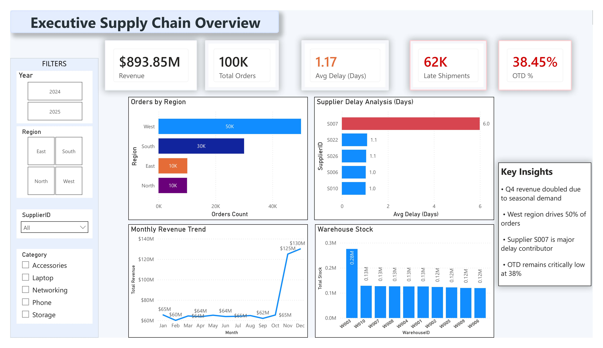
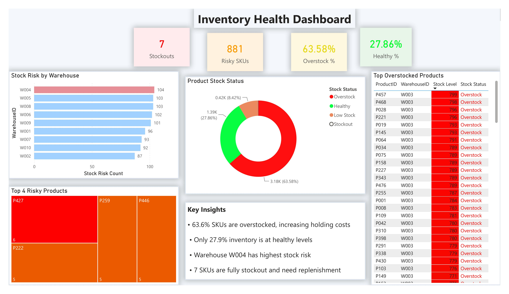
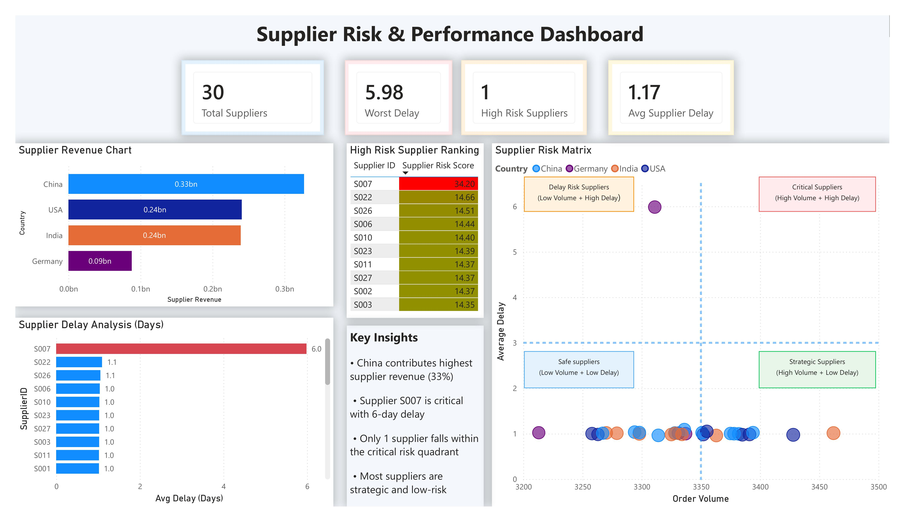
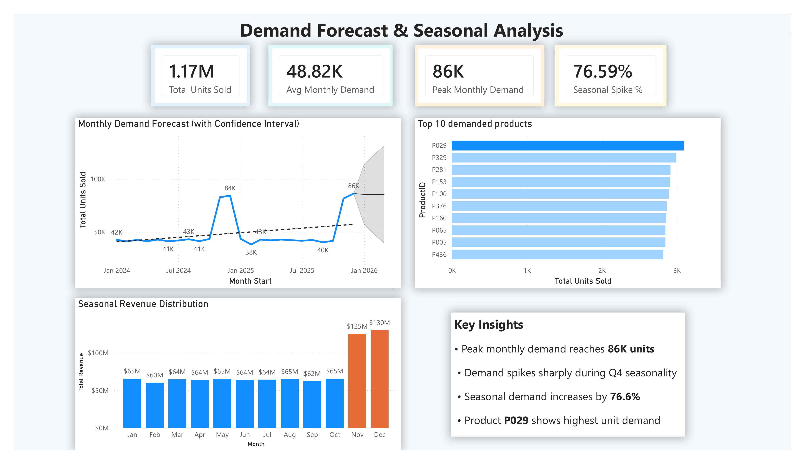
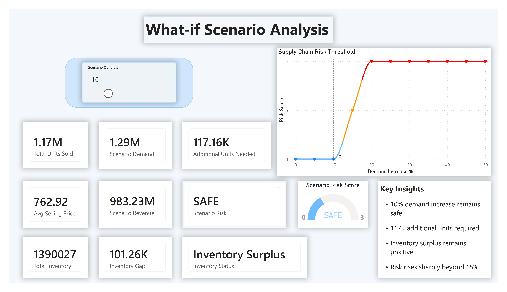

# 📦 Supply Chain Analytics Dashboard using Power BI


## 📌 Project Overview

This project presents an end-to-end **Supply Chain Analytics Dashboard** built using Microsoft Power BI to monitor supply chain performance, optimize inventory, evaluate supplier risks, forecast demand, and perform scenario-based decision-making.

The dashboard transforms raw supply chain transactional data into actionable business insights through interactive visual analytics, advanced DAX measures, forecasting, and what-if simulation.

This solution helps business stakeholders answer critical questions such as:

- Which suppliers pose operational risks?
- Where are inventory stockouts or overstock situations occurring?
- How does demand vary seasonally?
- What happens if demand suddenly increases?
- At what point does supply chain risk become critical?

---

## 🎯 Business Problem

Modern supply chains generate large volumes of operational data across:

- Orders
- Warehouses
- Inventory
- Suppliers
- Shipments

Without centralized analytics, organizations struggle to:

- Detect inventory imbalance
- Identify supplier bottlenecks
- Forecast seasonal demand
- Reduce delivery delays
- Plan for demand fluctuations

These challenges often lead to:

- Stockouts
- Overstock situations
- Increased holding costs
- Delayed deliveries
- Poor capacity planning

---

## 🎯 Business Objectives

This project aims to:

✅ Monitor overall supply chain performance using executive KPIs  
✅ Identify stockouts, low-stock, and overstock situations  
✅ Evaluate supplier performance and delay risks  
✅ Forecast future product demand using historical trends  
✅ Simulate demand increase scenarios using what-if analysis  

---

## 📂 Dataset Overview

The project uses multiple CSV datasets representing key supply chain entities.

### Tables Used

| Table | Description |
|------|-------------|
| Orders | Order-level transactions including quantity, revenue, dates |
| Products | Product metadata and category information |
| Inventory | Stock levels across warehouses |
| Suppliers | Supplier details and sourcing region |
| Shipments | Shipment and delivery records |
| Warehouses | Warehouse metadata and locations |

---

## 🧩 Data Model

The dashboard follows a **star-schema inspired model**.

### Fact Table
- Orders

### Dimension Tables
- Products
- Suppliers
- Warehouses
- Inventory
- Shipments
- Calendar Table

### Relationships
- One-to-many relationships between dimensions and fact table
- Date table used for time intelligence and forecasting
- Integrated model enables cross-functional analytics

---

## 🛠 Tools & Technologies

### Analytics Stack
- Microsoft Power BI
- Power Query
- DAX
- CSV Datasets

### Techniques Used
- Data Cleaning & Transformation
- Data Modeling
- Advanced DAX Measures
- Forecasting
- Scenario Analysis
- KPI Design
- Interactive Dashboard Development

---

# 📊 Dashboard Pages

---

## 1️⃣ Executive Supply Chain Overview

Provides high-level visibility into supply chain performance.

### KPIs
- Total Revenue
- Total Orders
- Average Delay
- Late Shipments
- On-Time Delivery %

### Visuals
- Orders by Region
- Monthly Revenue Trend
- Supplier Delay Analysis
- Warehouse Stock Distribution

### Screenshot


---

## 2️⃣ Inventory Health Dashboard

Monitors stock distribution and inventory risks.

### KPIs
- Stockouts
- Risky SKUs
- Overstock %
- Healthy Stock %

### Visuals
- Inventory Status Distribution
- Warehouse Risk Score
- Risky Product Analysis
- Overstock Product Table

### Screenshot


---

## 3️⃣ Supplier Risk & Performance Dashboard

Evaluates supplier reliability and risk.

### KPIs
- Total Suppliers
- Worst Delay
- High Risk Suppliers
- Average Supplier Delay

### Visuals
- Supplier Revenue Contribution
- Supplier Delay Analysis
- Supplier Risk Matrix
- Supplier Risk Ranking

### Risk Matrix Categories
- Safe Suppliers
- Strategic Suppliers
- Delay Risk Suppliers
- Critical Suppliers

### Screenshot


---

## 4️⃣ Demand Forecast & Seasonal Analysis

Analyzes demand patterns and future demand behavior.

### KPIs
- Total Units Sold
- Average Monthly Demand
- Peak Monthly Demand
- Seasonal Spike %

### Visuals
- Demand Forecast with Confidence Interval
- Top Products by Units Sold
- Seasonal Revenue Pattern

### Screenshot


---

## 5️⃣ What-if Scenario Analysis

Simulates demand growth and supply chain stress.

### Scenario Input
- Demand Increase Parameter (0–50%)

### KPIs
- Scenario Demand
- Additional Units Needed
- Scenario Revenue
- Inventory Gap
- Scenario Risk
- Inventory Status

### Visuals
- Risk Gauge
- Supply Chain Risk Threshold Curve
- Scenario KPI Cards

### Screenshot


---

# 📈 Key KPIs & DAX Highlights

## Revenue
```DAX
Revenue = SUM(orders[Revenue])
```

## Total Units Sold
```DAX
Total Units Sold = SUM(orders[Quantity])
```

## Scenario Demand
```DAX
Scenario Demand =
[Total Units Sold] *
(1 + DIVIDE([Selected Demand Increase], 100))
```

## Inventory Gap
```DAX
Inventory Gap =
[Total Inventory] - [Scenario Demand]
```

## Supplier Risk Score

Composite supplier risk score based on:

- Delivery delay
- Order volume
- Revenue contribution

Used to classify suppliers into risk quadrants.

---

# 🔍 Key Business Insights

### Executive Overview
- Q4 revenue nearly doubled due to seasonal demand surge
- West region contributes ~50% of total orders

### Inventory
- Significant SKU overstock increases holding costs
- Multiple products require immediate replenishment

### Supplier
- Supplier S007 shows severe delay risk
- Majority of suppliers remain low-risk and strategic

### Demand Forecast
- Demand spikes sharply during Q4 seasonality
- Product P029 drives highest unit demand

### Scenario Analysis
- Demand growth beyond 15–20% significantly increases supply chain risk
- Inventory buffer becomes critically low after threshold breach

---

# 💼 Business Impact

This dashboard enables supply chain managers and business leaders to:

- Proactively monitor operational bottlenecks
- Optimize inventory allocation
- Reduce stockout risk
- Improve supplier performance management
- Prepare for future demand spikes using scenario simulation

The solution improves decision-making by converting operational data into strategic intelligence.

---

# 🚀 Future Enhancements

Potential future improvements include:

- Real-time ERP integration
- Machine learning-based demand forecasting
- Automated supplier risk alerts
- Inventory replenishment recommendations
- AI-driven anomaly detection

---

# 📁 Repository Structure

```bash
Supply-Chain-Analytics-Dashboard/
│
├── README.md
├── dashboard/
│   └── Supply Chain Analytics Dashboard.pbix
│
├── datasets/
│   ├── orders.csv
│   ├── inventory.csv
│   ├── products.csv
│   ├── shipments.csv
│   ├── suppliers.csv
│   └── warehouses.csv
│
└── screenshots/
    ├── page1-overview.png
    ├── page2-inventory.png
    ├── page3-supplier.png
    ├── page4-forecast.png
    └── page5-scenario.png
```

---

# 👨‍💻 Author

**Vinay S S**  
Aspiring Business Analyst | Power BI Developer | Data Analytics Enthusiast

Connect With Me
LinkedIn: https://www.linkedin.com/in/vinay-s-s-1a011325a/
GitHub: https://github.com/vinayss-1847


---

## ⭐ Skills Demonstrated

✔ Data Modeling  
✔ Advanced DAX  
✔ Dashboard Design  
✔ Forecasting  
✔ Scenario Analysis  
✔ Business Storytelling  
✔ Supply Chain Analytics  
